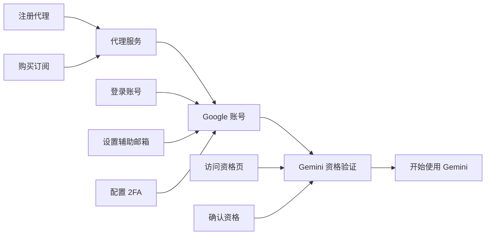
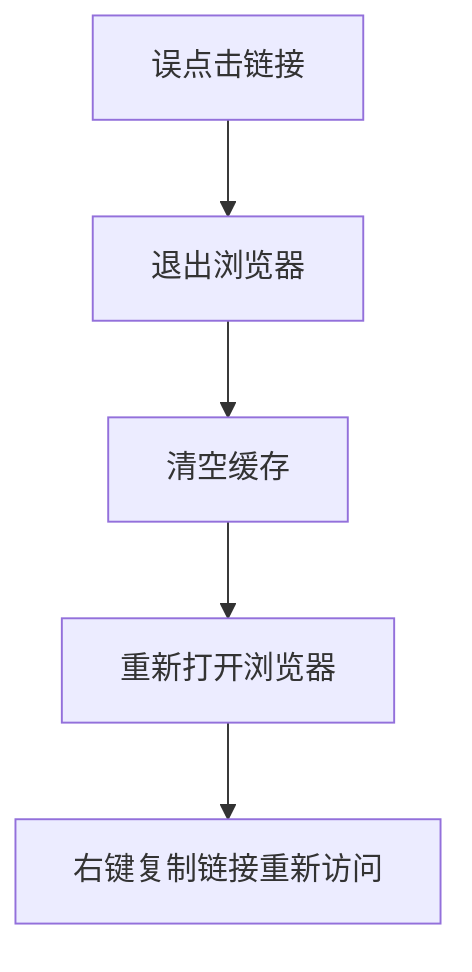
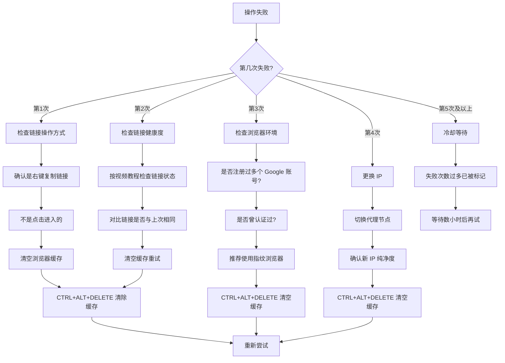

# 🌐 Google Gemini 完整使用教程

> 从零开始，完成代理配置 → Google 账号设置 → Gemini 资格激活全流程。

---

## 📋 整体流程概览

### 你需要准备
| 项目 | 说明 |
|------|------|
| 代理服务 | mojie.app（本章提供指引） |
| Google 账号 | 可使用共享账号（见下文） |
| 2FA 工具 | 浏览器访问 2fa.run |
| IP 检测工具 | ippure.com |

---

## 第一步：代理服务配置

### 1.1 注册代理账号

1. 打开代理链接：**[mojie.app/register](https://mojie.app/register)**
2. 完成注册流程
3. 登录后进入商城购买订阅

> **商城地址**: lyxazy.top
> 购买后如需查询订单，在商城首页顶部找到 **订单查询**，输入联系方式即可查看。

### 1.2 代理使用注意事项

- 连接代理后再进行后续所有操作
- 使用过程中如遇到连接问题，可使用 IP 检测工具确认代理状态：[ippure.com](https://ippure.com/)
- 建议选择与目标服务（Google）所在区域一致的节点

---

## 第二步：Google 账号设置

### 2.1 账号信息

| 字段 | 内容 |
|------|------|
| 账号 | AvonleaLoya154@gmail.com |
| 密码 | jdggsfl06ha |
| 辅助邮箱 | AvonleaLoya15455854@merrce.site |
| 2FA 密钥 | dgxj erws 5zli tr24 xori qthd rfzf 55gq |

### 2.2 2FA 验证码获取

1. 打开浏览器访问 **[2fa.run](https://2fa.run)**
2. 输入上方 2FA 密钥（2FA 密钥中的空格忽略或保留均可，工具会自动识别）
3. 点击生成，获取 6 位动态验证码
4. 使用该验证码完成 Google 账号登录

### 2.3 ⚠️ 风控提醒

> 这个账号刚在你的新设备登录，**请务必遵守以下规则**避免触发风控：

| ✅ 可以做的 | ❌ 不要做的 |
|-------------|-------------|
| 修改辅助邮箱 | 修改密码 |
| 正常使用 Gemini | 绑定手机号 |
| 日常登录使用 | 短时间内频繁修改多项设置 |

**只修改辅助邮箱**，其他设置保持原样。

### 2.4 修改辅助邮箱步骤

**电脑端：**

1. 打开 Google 账号管理页面
2. 点击左侧 **安全性与登录**
3. 在 **"您的 Google 账号登录选项"** 下方，点击 **辅助邮箱**
4. 按提示完成身份验证
5. 添加或更改辅助邮箱
6. 保存更改

**手机端：**

1. 打开设备 **"设置"** 应用
2. 点击你的 **账号名称** > **管理您的 Google 账号**
3. 点击 **安全性与登录**
4. 找到 **辅助邮箱** 选项
5. 按屏幕提示完成修改

---

## 第三步：Gemini 资格验证与激活

### 3.1 资格验证流程

完成代理连接和账号登录后，访问以下链接验证 Gemini 使用资格：

> **资格核实链接**：[one.google.com/ai-student](https://one.google.com/ai-student?g1_landing_page=75&utm_source=antigravity&utm_campaign=argon_limit_reached)

### 3.2 操作要点

- ✅ **右键复制链接**，在浏览器中粘贴打开
- ❌ **不要直接点击链接**打开，否则可能触发风控
- 如果点进去了，请：

### 3.3 视频教程参考

B 站详细操作视频：[b23.tv/UNBZs22](https://b23.tv/UNBZs22)

### 3.4 资格恢复方法

如果遇到资格丢失的情况，参考以下文档：
[资格恢复 Notion 文档](https://www.notion.so/2f350c6b209e809e9244f5402995b20f)

### 3.5 绑卡页面无资格解决

如果绑卡页面提示无资格，访问以下链接：
[绑卡无资格解决链接](https://one.google.com/ai?utm_source=antigravity&utm_campaign=argon_limit_reached&pli=1&g1_landing_page=75)

---

## 第四步：故障排除指南

### 4.1 失败原因排查流程

### 4.2 各步骤详细说明

#### 🔹 第1次失败
- **原因**：大概率是直接点击了链接访问
- **解决**：
  1. 完全退出浏览器
  2. 按 `CTRL + ALT + DELETE` 清除浏览器缓存
  3. 重新打开浏览器
  4. **右键复制链接** 粘贴到地址栏打开

#### 🔹 第2次失败
- **解决**：
  1. 参照教程视频检查链接是否健康
  2. 再次提取链接，检查是否与上次不同
  3. 如果不同，说明链接已更新
  4. `CTRL + ALT + DELETE` 清空缓存后重试

#### 🔹 第3次失败
- **原因**：浏览器环境问题（曾注册/认证过多个账号）
- **解决**：
  1. 检查浏览器是否登录过多个 Google 账号
  2. 建议使用 **指纹浏览器** 创建干净环境
  3. 一定用 `CTRL + ALT + DELETE` 清空缓存
  4. 重新尝试

#### 🔹 第4次失败
- **解决**：
  1. **更换 IP** — 切换到其他代理节点
  2. `CTRL + ALT + DELETE` 清空缓存
  3. 重新尝试

#### 🔹 第5次及以后
- **原因**：失败次数过多，已被系统标记
- **解决**：
  1. **暂停操作，等几个小时**
  2. 之后再按完整流程重试

### 4.3 代理连接状态检测

如果遇到页面全红或无法访问，使用 [ippure.com](https://ippure.com/) 检测：
1. 访问 ippure.com
2. 查看 IP 信息是否正常
3. 确认代理节点工作正常
4. 如果 IP 异常，关闭当前代理节点，切换新节点

---

## 五、附加资源

### 5.1 即梦 AI 提示词

- **Seedance 2.0 提示词库**：[youmind.com/zh-CN/seedance-2-0-prompts](https://youmind.com/zh-CN/seedance-2-0-prompts)
- 可用于即梦 AI 视频生成的提示词集合

### 5.2 构建智能体课程

- **链接**：[umdqe.xetslk.com/sl/2GOuzj](https://umdqe.xetslk.com/sl/2GOuzj)

### 5.3 相关工具汇总

| 工具 | 用途 | 链接 |
|------|------|------|
| 代理服务 | 科学上网 | mojie.app |
| 2FA 生成器 | 获取 6 位动态验证码 | 2fa.run |
| IP 检测 | 确认代理及 IP 纯净度 | ippure.com |
| Google One | Gemini 资格验证 & 管理 | one.google.com |
| 指纹浏览器 | 创建干净浏览器环境 | （自行搜索） |

---

> **⚠️ 安全提醒**
>
> 1. **账号安全**：共享账号请勿修改密码或绑定个人手机，以免影响其他使用者
> 2. **隐私保护**：涉及个人凭据的内容建议放在加密笔记中
> 3. **合规使用**：请遵守所在地区法律法规及目标平台的服务条款

---

## 相关笔记

- [[搭建知识库部署教程|搭建知识库部署教程]]
- [[知识库/README|知识库总入口]]
